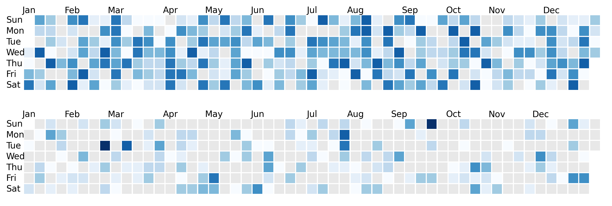
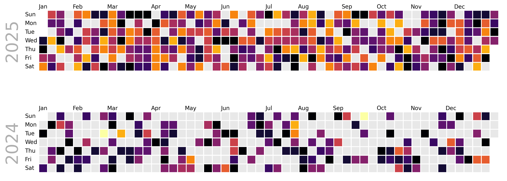

Since `dayplot` draws the chart on a matplotlib axes, it's quite easy to combine them.

For this, we need to create a figure with 2 axes (`nrows=2` since we want them to be one above the other). Then we plot the year 2024 below and the year 2025 above.

```py
import dayplot as dp
import matplotlib.pyplot as plt

df = dp.load_dataset()

fig, (ax1, ax2) = plt.subplots(nrows=2, figsize=(16, 4))

dp.calendar(
    dates=df["dates"],
    values=df["values"],
    start_date="2025-01-01",
    end_date="2025-12-31",
    ax=ax1, # top axes
)

dp.calendar(
    dates=df["dates"],
    values=df["values"],
    start_date="2024-01-01",
    end_date="2024-12-31",
    ax=ax2, # bottom axes
)
```



<br>

### Year label

It makes sense to add the year associated with each chart, so let's leverage `ax.text()` to add the years next to each chart.

```py
import dayplot as dp
import matplotlib.pyplot as plt

df = dp.load_dataset()

fig, (ax1, ax2) = plt.subplots(nrows=2, figsize=(16, 4))

dp.calendar(
    dates=df["dates"],
    values=df["values"],
    start_date="2025-01-01",
    end_date="2025-12-31",
    ax=ax1, # top axes
)

dp.calendar(
    dates=df["dates"],
    values=df["values"],
    start_date="2024-01-01",
    end_date="2024-12-31",
    ax=ax2, # bottom axes
)

text_args = dict(x=-4, y=3.5, size=30, rotation=90, color="#aaa", va="center")
ax1.text(s="2024", **text_args)
ax2.text(s="2025", **text_args)
```


